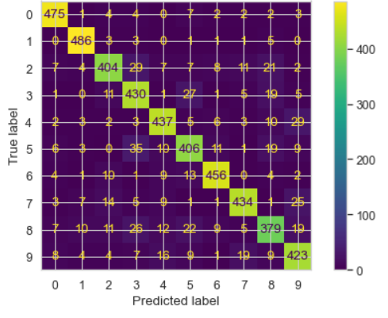
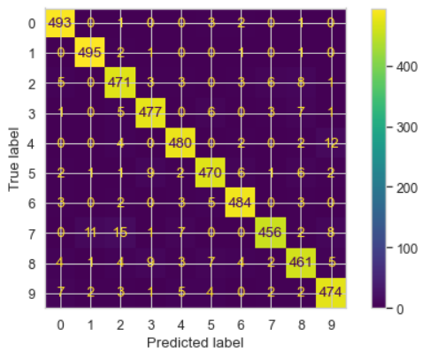
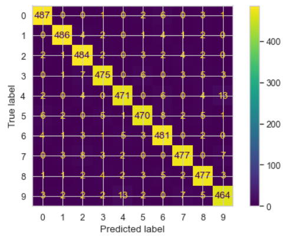

# Automating Hyperparameters Tuning and Model Benchmarking with ScikitLearn

## NON-TECHNICAL EXPLANATION OF THE PROJECT

The main goal of this project is to show how the search for the best set of hyperparameters can be automated for a given family of classification models. We are interested in models for image classification too. So that project can be seen as an introduction to AutoML techniques for image classification. In any case, we will be more interested in the hyperparameters search and model benchmarking techniques than in the sort of model selected here, and how performant could be for the task at hand. The focus is on the techniques, not on the resulting accuracies of the benchmarked models.

As a secondary objective, it is intended to show the limitations of this type of experiments on PCs and explain the need for AutoML tools in the cloud.

A final objective is to identify and learn the sort of training and search patterns for hyperparameters tuning and model benchmarking. These patterns are mostly based on pipes and are the same or very similar both, locally (PC) and in the cloud. ScikitLearn is designed around the pipe pattern and is a great framework to understand and learn these techniques.

## DATA

Because we will train many times the same model using different hyperparameters, we will choose a very simple training image dataset. We select as image dataset the Modified National Institute of Standards and Technology (MNIST) Dataset. The reason is that we require very simple images which will use very few computational resources and thus will facilitate each training step.

The MNIST database is also widely used for training and testing in the field of machine learning, and it became the classic standard the facto to compare performance between models of different families, architectures or hyperparameters. It is an extremely good database for people who want to try machine learning techniques and pattern recognition methods on real-world data while spending minimal time and effort on data preprocessing and formatting. Its simplicity and ease of use are what make this dataset so widely used and deeply understood.

The MNIST database is a large collection of handwritten digit images, each of size 28x28 pixels with 256 grey levels. The digits have been size-normalized and centered in a fixed-size image.

The MNIST database has a training set of 60,000 examples and a test set of 10,000 examples. The training set consists of handwritten numbers from 250 different people, of which 50% are high school students and 50% are from the Census Bureau.

You can find and download MNIST database here: http://yann.lecun.com/exdb/mnist/

The original MNIST dataset that you can find in the former url, is in a format that is difficult for beginners to use. The final MNIST dataset that we have been used, takes advantage of the work of [Joseph Redmon](https://pjreddie.com/) to provide the [MNIST dataset in a CSV format](https://pjreddie.com/projects/mnist-in-csv/).

The dataset consists of two files:

- `mnist_train.csv`
- `mnist_test.csv`

The `mnist_train.csv` file contains the 60,000 training examples and labels. The `mnist_test.csv` contains 10,000 test examples and labels. Each row consists of 785 values: the first value is the label (a number from 0 to 9) and the remaining 784 values are the pixel grey-scale values (a number from 0 to 255).

## MODEL

For that project, some valid family model candidates are K-Nearest Neighbors, Random Forest, Support-vector machines (SVM), Deep neural networks (DNN) and Convolutional neural networks (CNN), among others.

Because we will train many times the same model using different hyperparameters, we have chosen the SMV family as one of the simplest models able to recognize image patterns. The idea is to use a very simple model, hopefully, one that will require very little training time at each tuning step. In our particular case, we will see that with an undersampled MNIST training set (5,000 images), each training step will last 2-3 secs only.

## HYPERPARAMETER OPTIMISATION

Search for parameters of machine learning models that result in best cross-validation performance is necessary in almost all practical cases to get a model with best generalization estimate.

The description of which hyperparameters we have and how we have chosen to optimise them is the core of that project. By using cross-validation, we will compare SVC models with different Kernels, parameters, as well as one-versus-one approach. We will report the test error of the model picked.

- First, we use **Grid Search optimization**, on the following **search space**:

  ```python
  kernels = ('linear', 'poly', 'rbf')
  Cs = (0.001, 0.01, 0.1, 1, 10, 100, 1000)
  degrees = (3, 8, 10)
  gammas = ('auto', 'scale')

  param_grid = {'kernel': kernels, 'C': Cs, 'degree': degrees, 'gamma': gammas}
  param_grid
  ```

  A standard approach in scikit-learn is using **sklearn.model_selection.GridSearchCV** class, which takes a set of values for every parameter to try, and simply enumerates all combinations of parameter values. A more scalable approach is using **sklearn.model_selection.RandomizedSearchCV**, which however does not take advantage of the structure of a search space.

- Second, we use **Bayes Search optimization**, on the following **search space**:

  ```python
  bayes_opt = BayesSearchCV(
    svm.SVC(),
    {
        'C': (1e-6, 1e+6, 'log-uniform'),     # float valued parameter
        'gamma': (1e-6, 1e+1, 'log-uniform'), # float valued parameter
        'degree': (1, 8),                     # integer valued parameter
        'kernel': ['linear', 'poly', 'rbf'],  # categorical parameter
    },
    n_iter=64,
    cv=5,
    verbose=True
  )
  ```

  Scikit-optimize provides **skopt.BayesSearchCV** as a drop-in replacement for **sklearn.model_selection.GridSearchCV**, which ***utilizes Bayesian Optimization where a predictive model referred to as “surrogate” is used to model the search space and utilized to arrive at good parameter values combination as soon as possible***.

  Note that **Grid Search Optimization can use discrete dimensions, and thus a completely or partially discrete search space**. Now, **with Bayesian Optimization, we can naturally use continuous dimensions, and a more comprehensive search space**. In our example, `C` and `gamma` now are considered as continuous values between `0.000_001` and `1_000_000`. That means that searched space is "denser" and solved optimization problems are harder.

Finally, we **benchmark two models**. In practice, **one wants to enumerate over multiple predictive model classes, with different search spaces and number of evaluations per class.**

We present an example of such search over parameters of `SVM` family models and `MLP` neural network models. Both models, present different hyperparameters and training challenges (such as the number of iterations to converge):

```python
# explicit dimension classes - Real, Categorical, Integer - can be specified like this:
svc_search = {
    'model': Categorical([svm.SVC()]),                         # https://scikit-learn.org/stable/modules/generated/sklearn.svm.SVC.html
    'model__C': Real(1e-6, 1e+6, prior='log-uniform'),         # log-uniform: understand as search over p = exp(x) by varying x
    'model__gamma': Real(1e-6, 1e+1, prior='log-uniform'),     # log-uniform: understand as search over p = exp(x) by varying x
    'model__degree': Integer(1,8),
    'model__kernel': Categorical(['linear', 'poly', 'rbf']),
}

nn_search = {
    'model': Categorical([MLPClassifier(hidden_layer_sizes=(784, 128), max_iter=1_000, random_state=1)]),
                                                               # https://scikit-learn.org/stable/modules/generated/sklearn.neural_network.MLPClassifier.html
    'model__activation' : Categorical(['logistic', 'relu']),
    'model__alpha': Real(1e-6, 1, prior='log-uniform'),        # log-uniform: understand as search over p = exp(x) by varying x
    'model__learning_rate': Categorical(['constant', 'invscaling', 'adaptive']),
    'model__solver': Categorical(['sgd', 'adam']),
}
```

To fully automate this kind of experiments, we use **pipes**. That pattern is extensively used by ScikitLearn and is part of its core design. Using pipes we can automate the end-to-end benchmarking process, from getting and transforming the data to use, to launching experiments and collecting results. The `pipe` object (which includes all data preparation steps, model selection and model training steps), can be used as a replacement for the `model` object and thus be used as an estimator per-se:

```python
# pipeline class is used as estimator to enable search over different model types
pipe = Pipeline(steps = [('preprocess', column_transf),
                         ('model', svm.SVC())])                # model here is a kind of variable: its value
                                                               # will be redefined in the next search spaces.
```

Finally, **we perform Bayes Optimization on our new `pipe` estimator, using 5-folds cross-validation:**

```python
bayes_opt3 = BayesSearchCV(
    pipe,
    [(svc_search, 8), (nn_search, 8)],                         # (parameter space, # of evaluations) = (grid_search, n_iter)
    cv=5,
    verbose=3,                                                 # verbose=3 better than verbose=True only: you have to know there is no convergence problems,
                                                               # if not, results (scores) are not valid, and even the saved model could not be able to predict
    random_state=1
)
```

It is important to observe the logs of the process. You have to know whether there are or not convergence problems. When you have convergence problems, results (accuracy scores) are not valid, and the saved model at the end of the process might not be able to predict anything.

## RESULTS

That is a brief summary of the project results and some things learnt from it.

**First let's compare the results of the different approaches we have proposed:**

- **2. SVM Model Training using two different Kernels:**

  Here we trained two SVM models on the same training set and with default parameters. Accuracy and confusion matrix results are:

  - **Linear SVM:**
    - test set accuracy_score = 0.8798
    - test confusion matrix:

      

  - **RBF SVM:**
    - test set accuracy_score = 0.9536
    - test confusion matrix:

      

- **3. Hyper-parameter search by using cross-validation:**

  - **Grid Search:**
    - test set accuracy_score = 0.9588
    - Grid search best model result: {'C': 10, 'degree': 3, 'gamma': 'scale', 'kernel': 'rbf'}

  - **Bayes Search:**
    - test set accuracy_score = 0.9552
    - Bayes search best model result: [('C', 44.768273074030795), ('degree', 2), ('gamma', 0.7263010462077173), ('kernel', 'poly')]

- **4. MLP Model Training:**

  We also trained a NN model (a Multilayer Perceptron) on the same training set. Accuracy and confusion matrix results are:

  - test set accuracy_score = 0.9504
  - test confusion matrix:

    

- **5. Hyper-parameter search by using cross-validation**

  - **Bayes Search 2:**
    - test set accuracy_score = 0.9544
    - Bayes search 2 best model result: [('activation', 'relu'), ('solver', 'adam')]

- **6. Evaluating different ML model families with Sklearn BayesSearchCV and Pipes: a more comprehensive example**

  - **Bayes Search 3:**
    - test set accuracy_score = 0.8408
    - Bayes search 3 best model result: [('model', SVC(C=735.4496833294961, degree=7, gamma=0.006630670566664593, kernel='poly'))]

**To wrap up this project, some conclusions after this learning experiment are:**

- Pipes pattern helps to organize automatic and clean execution of hyperparameter search and model benchmarking.

  For example, in 6. we benchmarked 2 different family models (SVMs and MLPs), searching the best hyperparameters at the same time.

  Pipes play a key role in ScikitLearn.

- Hyperparameter search and model benchmarking consume a great number of resources. As we have seen in the learning experiments included in this notebook, most of the time you cannot easily perform these processes on a PC or laptop.

  For example, because in 6. we evaluated 2 different family models (SVMs and MLPs), each with its own search space, we were forced to reduce the number of Bayes Iterations to only 16 to not extend the process more than 3 hours. As a result we had a low test accuracy (0.8408) in 6., much worse than in 1. (0.9504).

  A usual solution is moving everything to the cloud.

- The fundamentals of AutoML are established in this notebook: usual patterns, challenges and solutions.

- It is important the revision of the logs in these processes, looking for no convergence warnings. A non-convergent model could imply a lack of predictive accuracy. The only solution many times is an increased computational power and process time.

## CONTACT DETAILS

You can contact me at: ghernantes@gmail.com